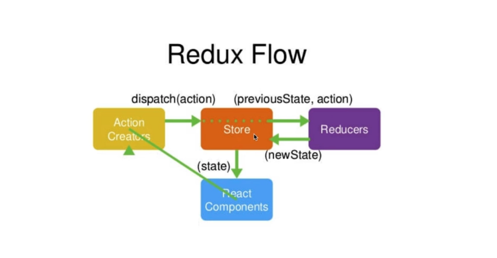

This project was bootstrapped with [Create React App](https://github.com/facebook/create-react-app).

这是一个基于React的TodoList练手小组件，主要练习使用Redux
---
运行 

`
  npm start
`

### Redux的一点简单总结  
---
` Store `可看作主要的中间转换人，用于在组件（` Component `）和 ` Reducer ` 间传递修改数据，流程大致如下：  
首先 ` Component ` 通过 ` store.dispatch ` 将 ` action ` 信息传递到 ` Store `, ` Store ` 通过接收到的 ` action ` 的值去 ` Reducer ` 内进行查询，然后 ` Reducer ` 将数据传回给 ` Store `,并在 ` Store ` 中改变 ` State ` 再传回给 ` Component `， 更新页面。  

 

> 注意：  
> 1. ` Store ` 是唯一的能修改 ` state ` 内容的；  
> 1. ` Reducer ` 是纯函数  

  主要API：  
  ` store.dispatch() `  派发组件的 ` action ` 到 ` Store ` ;  
  ` store.getState() `  获取 ` Store ` 的 ` state `值；  
  ` store.subscribe() ` 订阅 ` Store ` 的内容，可在获知修改值后获取该新值 

